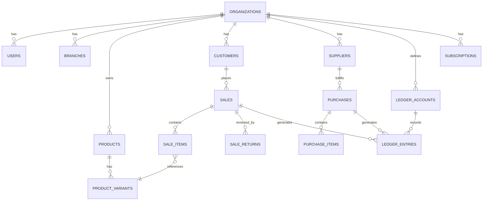

# Technical Foundation Plan
### Multi-Tenant Business Management & Accounting Platform
**First vertical: Footwear Wholesale — Famous Footwears (Ambikapur, Chhattisgarh)**

*Status: six architectural decisions below are finalized. This is still a design document — no schema, code, or UI has been built.*

---

## Architecture Decision Records (ADR-001 – ADR-006)

### ADR-001 — Supabase Usage Boundary
- **Decision:** Supabase is used only as hosted PostgreSQL and (where appropriate) Supabase Auth. All business transactions flow: React frontend → Express API → Domain/Business Services → Accounting Core → PostgreSQL. The frontend never calls Supabase's auto-generated data API for business data.
- **Reason:** Keeps the Accounting Core as the single writer of financial records; nothing can bypass validation, tenant scoping, or ledger posting.
- **Impact:** More backend code than "just use Supabase's REST API," in exchange for guaranteed consistency and auditability.
- **Limitation:** Supabase Auth may still be called directly by the frontend for login/session — that's identity, not a financial record, so it doesn't break the rule.
- **Tested by:** A code-review/lint check that no frontend code imports the Supabase data client for business tables, plus RLS policies that deny direct writes to business tables from anything but the API's service role.

### ADR-002 — Business-Module Configuration Boundary
- **Decision:** Vertical-specific fields live in JSONB/config, validated at the application/domain layer per business type. The Accounting Core contains zero business-type branching.
- **Reason:** New verticals become new config + a module package, not core changes.
- **Impact:** Adding mobile/pharmacy/etc. later never touches `accounting-core`.
- **Limitation:** JSONB trades some DB-level type safety and query performance for flexibility; mitigated by app-level schema validation per business type.
- **Tested by:** Unit tests that reject invalid attribute payloads per business type, plus a static check that `accounting-core` has no reference to any `business_type` value.

### ADR-003 — Multi-Tenancy Model
- **Decision:** Shared database, shared schema, `organization_id` on every tenant-scoped row, plus Postgres Row-Level Security. Org context comes only from the authenticated session/token, never from request-body input.
- **Reason:** Simple and cost-efficient at MVP scale; RLS adds DB-level defense in depth beneath app-level scoping.
- **Impact:** Every query must filter by org; every table needs an RLS policy.
- **Limitation:** Not physically isolated — a serious RLS misconfiguration could theoretically cross tenants. Schema/DB-per-tenant is deferred to a possible future enterprise tier, not built now.
- **Tested by:** An automated test with two seeded organizations asserting neither can read or write the other's rows, including via crafted requests that try to override org context.

### ADR-004 — Footwear Sizing Model
- **Decision:** Numeric sizes with half-size increments (6, 6.5, 7, 7.5 … 10), stored as a decimal — not free text — for the footwear module. The variant model itself stays generic so other verticals can define their own dimensions later.
- **Reason:** Matches real wholesale usage and keeps stock reporting/sorting reliable.
- **Impact:** `product_variants.size` is numeric for footwear; other verticals use their own attribute keys via the same variant/attribute pattern.
- **Limitation:** Doesn't yet cover non-standard sizing (kids' sizes, EU/US systems) — deferred, and addable later via a `size_system` field without breaking the model.
- **Tested by:** Input validation rejecting non-half-step values (e.g. 7.3); seed data covering a full size run per product.

### ADR-005 — Tax / GST Architecture
- **Decision:** A dedicated server-side tax calculation service, not embedded in UI. Tax is computed at the line-item level: taxable value, applicable rate, CGST/SGST/IGST split, discount treatment, line total, invoice total, and rounding — driven by configurable rate tables keyed by HSN/category, not hard-coded into the footwear module.
- **Reason:** Tax rules vary by product and change over time; one service means one place to update and audit, reusable by every future vertical.
- **Impact:** Sales/purchase posting calls the tax service before `AccountingEngine.postTransaction()`; invoices render the same computed breakdown rather than recalculating.
- **Limitation:** MVP covers standard intra-state (CGST+SGST) and inter-state (IGST) calculation with configurable rates and a documented rounding rule. Edge cases (reverse charge, composition scheme, etc.) are explicitly out of scope until separately decided.
- **Tested by:** Table-driven unit tests built from documented worked examples (rate + amount → expected CGST/SGST/IGST/total), written and reviewed *before* any UI touches tax.

### ADR-006 — Sales Transaction Lifecycle
- **Decision:** Draft → Confirmed → Cancelled. A Draft has no stock or ledger effect and is editable. Confirming posts the stock movement, ledger entries, receivable, and any payment, and makes the sale financially immutable. A Cancelled sale is only possible from Draft (nothing was posted to reverse). Reversing a Confirmed sale always goes through a linked sale-return record — never an edit or delete.
- **Reason:** Matches real quoting-before-committing workflows while protecting "immutable once posted."
- **Impact:** `sales.status` column plus guard logic blocking any update to a Confirmed sale's items/amounts; a Confirmed sale can only be corrected via `sale_returns`.
- **Limitation:** A Confirmed sale can't be "un-confirmed" — correcting a mistaken confirmation is always a return. Worth flagging in staff training/UAT so it isn't mistaken for a bug.
- **Tested by:** Integration tests that (a) reject a direct edit to a Confirmed sale, (b) confirm a Draft sale produces zero stock/ledger rows, (c) confirm that Confirming posts exactly the expected ledger rows.

---

## 1. System Architecture

| Layer | Responsibility | Tech |
|---|---|---|
| Client | UI, i18n, forms, dashboards | React + TypeScript + Vite + Tailwind |
| API / Domain | Accounting Engine, Business Modules, Platform Services | Node.js + Express + TypeScript |
| Data | Tenant-isolated storage | PostgreSQL (Supabase-hosted), Drizzle ORM |

Confirmed flow (ADR-001): **React → Express API → Domain/Business Services → Accounting Core → PostgreSQL.** The Accounting Core is the only code allowed to write financial records; no screen or module computes/stores a balance independently.

## 2. Project Folder Structure

```
/apps
  /web              # React app
  /api              # Express app (routes → services → accounting-core)
/packages
  /accounting-core  # ledger, transactions, chart of accounts
  /tax-engine       # GST calculation service (ADR-005)
  /business-modules
    /footwear
    /_template      # scaffold for the next vertical
  /i18n             # translation bundles + resolver
  /db               # drizzle schema + migrations
  /shared-types
/infra
  /migrations
  /seed
```

## 3. Database ERD (core entities)



## 4. Core PostgreSQL Tables (condensed)

`organizations`, `business_types`, `users`, `org_users` (role), `branches`, `org_modules`, `products`, `product_variants`, `customers`, `suppliers`, `sales` (with `status`: draft/confirmed/cancelled), `sale_items` (with taxable_value, cgst, sgst, igst, line_total), `sale_returns`, `purchases`, `purchase_items`, `purchase_returns`, `payments`, `ledger_accounts`, `ledger_entries`, `expenses`, `plans`, `subscriptions`, `audit_log`.

Every tenant-scoped table carries `organization_id` + `created_at`/`updated_at`. Financial tables are **append-only** once a sale/purchase reaches Confirmed — no `UPDATE` on a posted row, ever (ADR-006).

## 5. Relationships

- `organization_id` is the tenant discriminator on every scoped table (ADR-003).
- Sale → `sale_items` → `product_variants` (stock effect, only on Confirm); Sale → `ledger_entries` (financial effect, only on Confirm); Customer → `ledger_entries` (via a customer sub-ledger account).
- Sale → `sale_returns` for any reversal of a Confirmed sale (ADR-006).
- Purchase mirrors Sale on the supplier side.

## 6. Multi-Tenant Strategy — *confirmed, ADR-003*

Shared database, shared schema, `organization_id` column plus Postgres RLS as a second enforcement layer beneath app-level scoping. No database-per-tenant or schema-per-tenant for MVP; revisit only for a future enterprise tier.

## 7. Accounting Transaction Strategy

- `ledger_accounts` = chart of accounts (Cash, Bank, Sales, Purchases, Inventory, Customer Receivable, Supplier Payable, Tax Payable, Expense categories).
- `ledger_entries` = immutable rows (org_id, account_id, debit/credit, reference_type, reference_id, date). Corrections are reversing entries, never in-place edits.
- Lifecycle (ADR-006): a sale/purchase in **Draft** touches neither stock nor ledger. **Confirming** it calls the tax service (ADR-005) then `AccountingEngine.postTransaction()` inside one DB transaction — stock, ledger, and receivable/payable update together or not at all. **Cancelled** only applies pre-Confirm; post-Confirm corrections go through `sale_returns`/`purchase_returns`.
- Every reported balance is computed by summing `ledger_entries`/`stock_movements`, never stored as an independently-edited number.

## 8. Business-Module Strategy — *confirmed, ADR-002*

A `business_types` row holds per-vertical config (terminology, variant dimensions, enabled modules, dashboard widgets, report set) as JSON, validated at the application layer. Genuinely different behavior (IMEI uniqueness, batch expiry) goes through a small injected strategy interface — the Accounting Core never branches on business type.

## 9. Footwear Module Data Model

- `products`: name, brand, category, model/design, HSN, purchase_price, wholesale_price, org_id.
- `product_variants`: product_id, **size (numeric, half-size steps — ADR-004)**, colour, SKU, opening_stock, current_stock.
- `stock_movements`: variant_id, type (sale/purchase/return/adjustment), quantity, reference — the audit trail behind `current_stock`, written only when a transaction is Confirmed.

## 10. Localization / i18n Strategy

- Frontend: i18next-style JSON bundles per language, namespaced (`common`, `footwear`, `accounting`). No hardcoded UI strings.
- A terminology layer maps a canonical entity (e.g. `customer`) to a display label per (business_type, language, org override).
- `users.preferred_language` overrides `organizations.default_language`.

## 11. Authentication / Authorization

- Supabase Auth (or JWT) issues a token carrying `user_id`, `org_id`, `role` — used for identity only, per ADR-001; business data still goes through the Express API.
- Every API request is scoped to `org_id` from the verified token, never from the request body.
- RBAC roles (Owner, Manager, Sales Staff, Accountant) map to a permission matrix per module/action.
- Postgres RLS mirrors the same org/role rules as a second line of defense.

## 12. Subscription Architecture

- `plans` (name, price, billing_cycle, limits: users/branches/modules).
- `subscriptions` (org_id, plan_id, status, started_at, renewed_at).
- `org_modules` derived from plan + manual override.
- No payment gateway yet; schema leaves room for a `payment_gateway_ref` field for later.

## 13. API Structure

- REST, versioned (`/api/v1`), resource-oriented: `/products`, `/product-variants`, `/customers`, `/suppliers`, `/sales`, `/purchases`, `/payments`, `/ledger`, `/reports`, `/tax/calculate`.
- Route handlers never write financial rows directly — they call Domain Services → Accounting Core.
- One consistent envelope for success and error responses.

## 14. Tax / GST Calculation Layer — *new, ADR-005*

- A standalone `tax-engine` service takes a line (HSN/category, quantity, rate, discount) and returns taxable value, CGST/SGST/IGST (based on intra- vs inter-state), line total, and rounding — using configurable rate tables, not hard-coded percentages.
- Called during Confirm, before `AccountingEngine.postTransaction()`; the same computed breakdown is what the invoice prints, so the invoice and the ledger can never disagree.
- Scope for MVP: standard CGST+SGST / IGST calculation with a documented rounding rule. Reverse charge, composition scheme, and similar edge cases are explicitly deferred.
- Before this is implemented: a short written spec with worked numeric examples (a few line items, expected tax breakdown) should be reviewed and turned into the unit test suite first.

## 15. Testing Strategy

- Unit tests on the Accounting Core and Tax Engine first — the parts that cannot be wrong.
- Cross-tenant RLS test (ADR-003), lifecycle-immutability test (ADR-006), and tax worked-examples (ADR-005) are treated as required tests, not optional extras.
- Integration tests per milestone against a seeded test organization; a footwear seed dataset for repeatable testing.
- A milestone isn't "done" until its tests pass.

## 16. Migration Strategy

Drizzle migrations, one file per schema change, committed to GitHub, never edited after merge — only new migrations for further changes. Timestamp-prefixed filenames for deterministic ordering.

## 17. Security Considerations

- RLS + app-level org scoping (defense in depth).
- Input validation (e.g. zod) at every API boundary.
- Append-only `audit_log` for any change touching a financial record.
- Rate limiting on auth endpoints; secrets via environment variables only; HTTPS everywhere.

## 18. Development Milestones

Architecture → schema → migrations → auth → multi-tenancy → org setup → users/roles → accounting foundation → customers → suppliers → products → inventory engine → footwear size-wise inventory → purchases → sales → payments/receipts → ledgers → returns → expenses → dashboard → reports → invoice/PDF → validation → testing → security review → UI refinement. Each milestone ends with a working, tested slice, committed to GitHub, before the next starts.

---

*All six ADRs above are finalized. Next step, on your go-ahead, is Milestone 2: the concrete Drizzle schema and migration for these tables — not started yet.*
